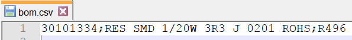
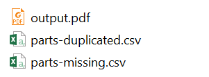
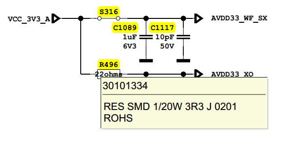
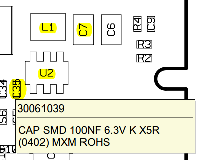

#### Description
Tool is used to annotate text on pdf files.  
Sometimes BOM list in production database and schematic may not be correctly aligned. This tool helps to visually see exact database values (BOM list) on schematic or reference designator pdf file. 

#### Usage
Place input files to working directory;  
- schematic or refdes pdf as "input.pdf"  
- bom list with the name "bom.csv".  

  
"bom.csv" should be in the form as below line (semicolon ';' as separator is preferred). However comma ',' as separator is also fine.  
> 3xxxx;RES SMD ...;Rxxx  

  

It will generate "output.pdf" with "bom.csv" annotated on it and "parts-missing.csv", "parts-duplicated.csv" if any...  
  
Text is annotated on "output.pdf", when mouse is hovered on marked area, component detail is shown in pop up window.  
  
  

#### Known bugs and issues
- S1 in FS1, S1 in S15 may be incorrectly annotated.  
- Diode D1 will match with D1 ball number of BGA IC and incorrectly annotated.  
- Since ',' and ';' is accepted as separator in bom list, it may fail if those are included in component definition (ie 10,5K OHM).  
- Resulting pdf doc size will be increased.  

#### Resources
Requires PyMuPDF, tested with version 1.19.6.  
Origin repo at github.com/eardali

#### License
Distributed under the terms of the MIT license.
